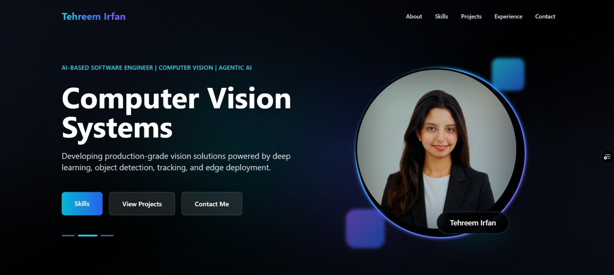
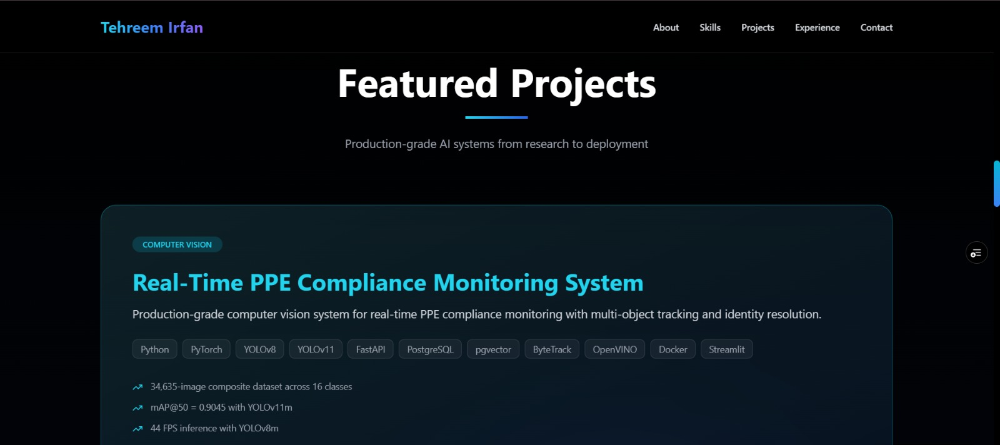
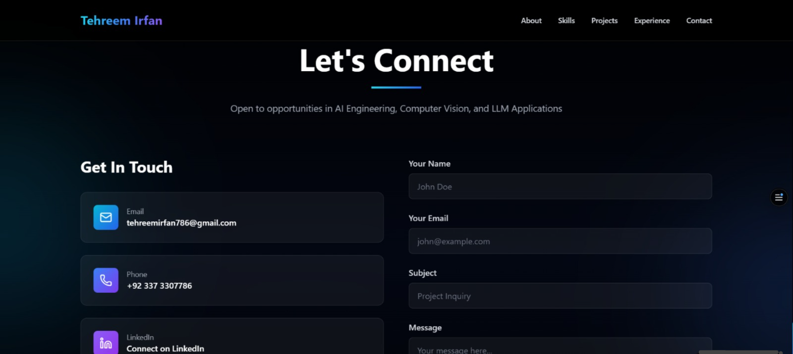

# Tehreem Irfan - AI Engineer Portfolio

## Overview

This is my personal AI Engineer portfolio website built to showcase my projects, skills, and experience in:

- Artificial Intelligence
- Computer Vision
- Agentic AI
- Machine Learning
- Full Stack Development

The website features project showcases, GitHub integration, animated UI components, and a contact form powered by FastAPI and Resend.

## Demo

Portfolio Website:
https://portfolio-one-amber-idvr98xn6k.vercel.app/

## Screenshots



## Projects Section


### Contact Section


## Highlights

- Built using React and FastAPI
- Integrated GitHub project APIs
- Implemented email communication with Resend
- Configured serverless deployment on Vercel
- Responsive and mobile-friendly UI

## Project Structure

```text
.
|-- api/
|   `-- index.py                 # Vercel serverless entrypoint for FastAPI
|-- backend/
|   |-- server.py                # FastAPI app and API routes
|   |-- requirements.txt         # Backend development dependencies
|   `-- services/
|       |-- email_service.py     # Resend email service
|       `-- github_service.py    # GitHub projects service
|-- frontend/
|   |-- package.json             # React app dependencies and scripts
|   |-- public/
|   `-- src/
|       |-- App.js
|       |-- mock.js
|       `-- components/
|-- requirements.txt             # Minimal Python dependencies for Vercel
|-- vercel.json                  # Vercel build and routing config
`-- README.md
```

## Features

- React portfolio frontend
- Framer Motion animations
- Tailwind CSS styling
- FastAPI backend
- GitHub projects API
- Contact form email sending with Resend
- Vercel-ready full-stack deployment

## Tech Stack

### Frontend

- React
- CRACO
- Tailwind CSS
- Framer Motion
- Lucide React

### Backend

- FastAPI
- Pydantic
- Requests
- Resend
- Python Dotenv

### Deployment

- Vercel
- Vercel Python Functions
- GitHub

## Local Development

You need to run the backend and frontend in two separate terminals.

### 1. Backend Setup

From the project root:

```bash
cd backend
pip install -r requirements.txt
```

Create a local environment file:

```text
backend/.env
```

Add:

```env
RESEND_API_KEY=your_resend_api_key
RECIPIENT_EMAIL=your_email@example.com
SENDER_EMAIL=onboarding@resend.dev
```

Start the backend:

```bash
uvicorn server:app --reload --host 127.0.0.1 --port 8000
```

Backend URL:

```text
http://127.0.0.1:8000
```

Test routes:

```text
http://127.0.0.1:8000/api/
http://127.0.0.1:8000/api/github/projects
```

### 2. Frontend Setup

Open a second terminal from the project root:

```bash
cd frontend
npm install
```

Create a local environment file:

```text
frontend/.env
```

Add:

```env
REACT_APP_BACKEND_URL=http://127.0.0.1:8000
```

Start the frontend:

```bash
npm start
```

Frontend URL:

```text
http://localhost:3000
```

## Production Build

To create a frontend production build locally:

```bash
cd frontend
npm run build
```

The production build is generated in:

```text
frontend/build
```

## Vercel Deployment

This project is configured for Vercel using:

```text
vercel.json
api/index.py
requirements.txt
```

The Vercel config builds the React frontend from `frontend/` and routes `/api/*` requests to the FastAPI app.

### Required Vercel Environment Variables

Add these in:

```text
Vercel Dashboard -> Project -> Settings -> Environment Variables
```

```env
RESEND_API_KEY=your_resend_api_key
RECIPIENT_EMAIL=your_email@example.com
SENDER_EMAIL=onboarding@resend.dev
```

Do not add `REACT_APP_BACKEND_URL` on Vercel unless you are using a separate backend URL. In the current setup, the frontend calls same-domain API routes such as:

```text
/api/contact/send
/api/github/projects
```

### Vercel Import Settings

When importing the GitHub repository into Vercel:

```text
Framework Preset: Other or Create React App
Build Command: cd frontend && npm ci && npm run build
Output Directory: frontend/build
```

If Vercel reads `vercel.json`, these settings may be detected automatically.

### After Deployment

Test these URLs:

```text
https://your-site.vercel.app/
https://your-site.vercel.app/api/
https://your-site.vercel.app/api/github/projects
```

Then test the contact form on the live site.

## GitHub Upload Checklist

Upload these files and folders:

```text
.gitignore
README.md
contracts.md
requirements.txt
vercel.json
api/
backend/
frontend/
memory/
```

Do not upload:

```text
frontend/.env
backend/.env
frontend/node_modules/
frontend/build/
backend/__pycache__/
.git/
```

## Contact Form Notes

The contact form sends data to:

```text
POST /api/contact/send
```

Email sending requires a valid Resend API key. For production, use a verified Resend domain or sender when possible.

## Contact

**Tehreem Irfan**

AI Engineer | Computer Vision | Agentic AI

Email: [tehreemirfan786@gmail.com](mailto:tehreemirfan786@gmail.com)

LinkedIn:
https://www.linkedin.com/in/tehreem-irfan-8a3504274/

GitHub:
https://github.com/Tehreemirfan123

## License

This project is intended for personal portfolio and professional showcase purposes.
